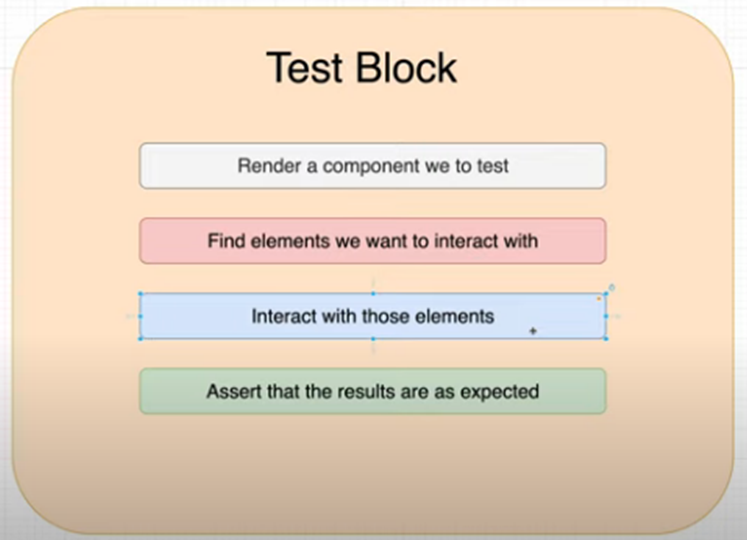

_This notes are related to the youtube course of "The Net Ninja" for React-Testing-Library, also, this will be complemented with screenshots and other sources of information that add to the content._

# What

React Testing Library focuses on testing components from the end-user’s experience rather than testing the implementation and logic of the underlying React components.

# Structure of the test

[DetailedExplanation][ref1]

### Usefull resources

[9TipsAndTricks][ref2] Source: Paige Niedringhaus Article (2020)
[CoveringAllTheBasics][ref3] Source: Chidi Orji Article (2020)
[DetailedTypeOfTests][ref4] Source: Ibrahima Ndaw Article at freecodecamp (2020)

[ref1]: https://www.youtube.com/watch?v=SppbtlpPZu4&list=PL4cUxeGkcC9gm4_-5UsNmLqMosM-dzuvQ&index=4
[ref2]: https://betterprogramming.pub/9-react-testing-library-tips-and-tricks-5cce3e458282
[ref3]: https://www.smashingmagazine.com/2020/07/react-apps-testing-library/
[ref4]: https://www.freecodecamp.org/news/8-simple-steps-to-start-testing-react-apps-using-react-testing-library-and-jest/
